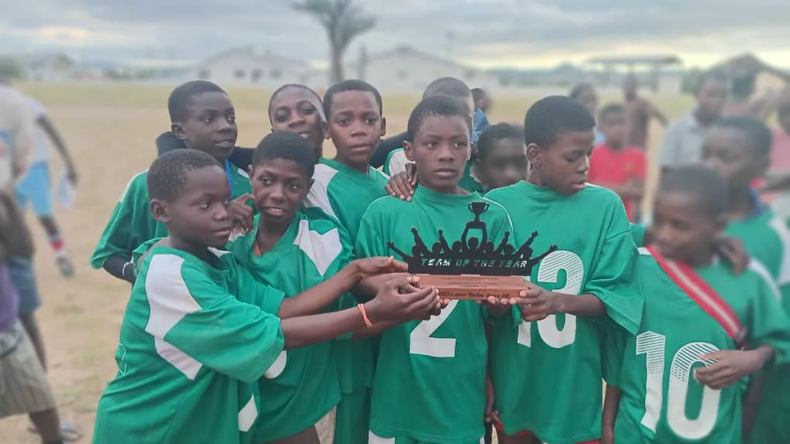
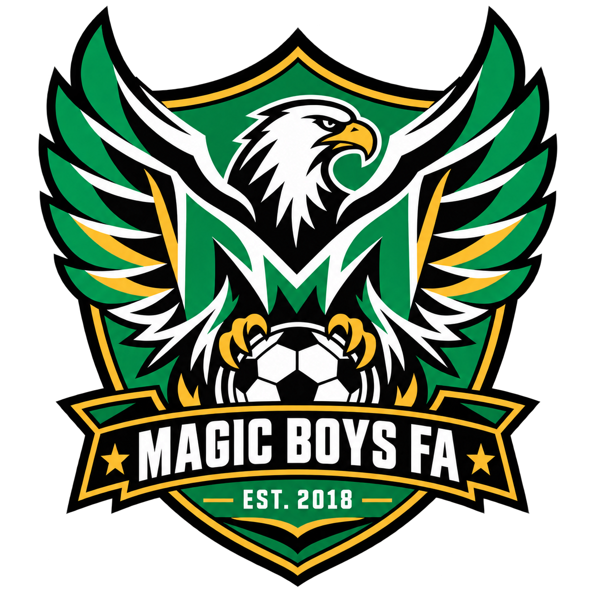

  

  

# Magic Boys Football Academy — Community Football, Made Visible

**[Visit the live website](https://magicboys.pages.dev/)**

Magic Boys Football Academy is a Namibian community academy founded by Coach Naftal to give young people a disciplined, positive place to play, learn and grow. This project turns that purpose into a public identity that can earn trust, attract support and help the academy reach future partners.

## The brief

The academy had heart, photographs and a clear need for stronger visibility—but no cohesive digital home. The work needed to feel energetic and joyful without turning the children into marketing material. It also needed a simple sponsorship path that an interested person could use immediately.

## What shipped

- A completely reimagined Magic Boys FA crest
- A bright, mobile-first website with a lively match-day rhythm
- A clear story around football, learning, discipline and belonging
- Dedicated visibility for the U13, U15 and U20 squads
- Sponsorship needs grouped around kit, travel, training and learning
- Direct WhatsApp contact through Coach Naftal
- A respectful future partnership signal with Runnerz Namibia
- Cloudflare Pages deployment with security headers and responsive imagery

## Safeguarding by design

This is a youth-facing project, so privacy is part of the architecture—not a disclaimer added at the end.

- No child is named on the public site.
- No personal player profiles, ages, schools or addresses are published.
- Every enquiry is routed through the adult coach.
- The gallery uses team context rather than individual biographies.
- Public documentation excludes the original voice note and private working material.

## Design direction

The identity uses electric green, warm gold, cream and deep pitch-black. Condensed type creates the energy of football posters; rounded calls to action and warm copy keep the experience human. Motion is expressive but optional, and the small-screen layout was treated as the primary experience.

The guiding line became:

> Play. Learn. Rise.

## Product boundary

This repository is a public case study. Production source, original media, private working files and deployment credentials remain private. The photographs shown here are not licensed for reuse.

## Role

Discovery · audio-led story extraction · brand direction · identity design · UX/UI · responsive frontend engineering · accessibility · privacy architecture · Cloudflare deployment

## Links

- [Magic Boys Football Academy](https://magicboys.pages.dev/)
- [Runnerz Namibia](https://runnerznamibia.com)
- [Freeman Ipumbu portfolio](https://freeman-ipumbu.pages.dev/)

---

An experience by **SolarSpin Technologies**. Built for the boys, their coaches and the future ahead.
